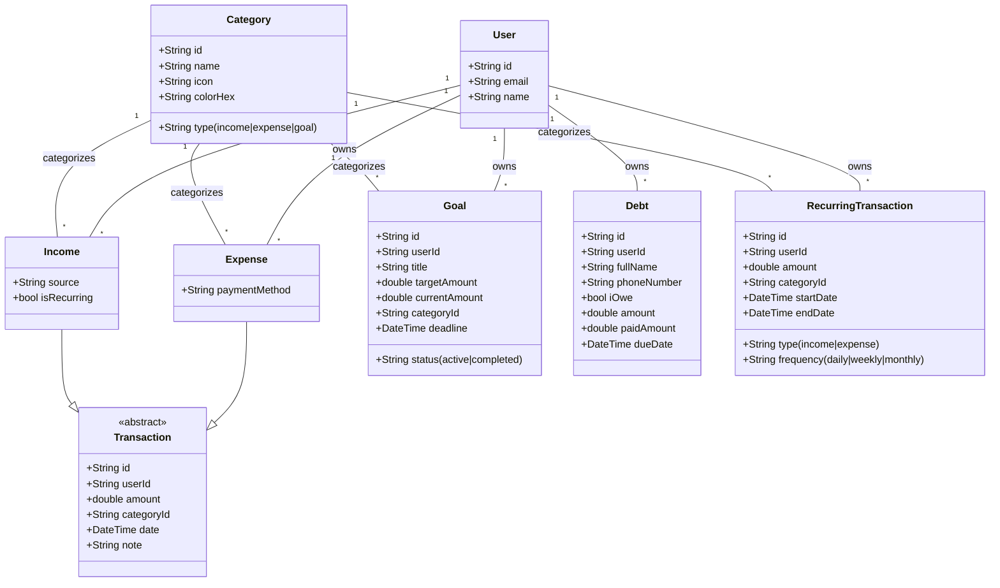

# Appwrite Database Conception & UML

This document provides a comprehensive overview of the database structure for the **Hsabi** finance application using Appwrite.

## 1. Appwrite Database Concepts

Appwrite's Database service is a flexible NoSQL-like database that uses **Collections** and **Documents**.

### Key Concepts
- **Database**: A container for your collections.
- **Collection**: Similar to a table in SQL or a collection in MongoDB. It has a schema defined by attributes.
- **Document**: An individual record within a collection.
- **Attribute**: A field in a document (String, Integer, Float, Boolean, Email, URL, IP, Enum, Relationship).
- **Index**: Used to optimize query performance.
- **Permissions**: Granular control over who can Create, Read, Update, and Delete (CRUD) documents.

---

## 2. UML Class Diagram

The following diagram illustrates the relationships between the models in your Flutter application.

---

## 3. Appwrite Collections Schema

Based on your Flutter models, here is how you should configure your Appwrite collections.

### Collection: `categories`
| Attribute | Type | Size | Required | Array | Default |
|-----------|------|------|----------|-------|---------|
| `name` | String | 128 | Yes | No | - |
| `icon` | String | 64 | Yes | No | - |
| `colorHex` | String | 7 | Yes | No | - |
| `type` | Enum | - | Yes | No | - |

### Collection: `expenses`
| Attribute | Type | Size | Required | Array | Default |
|-----------|------|------|----------|-------|---------|
| `userId` | String | 36 | Yes | No | - |
| `amount` | Float | - | Yes | No | - |
| `categoryId` | String | 36 | Yes | No | - |
| `paymentMethod`| String | 64 | Yes | No | - |
| `date` | DateTime | - | Yes | No | - |
| `note` | String | 512 | No | No | null |

### Collection: `incomes`
| Attribute | Type | Size | Required | Array | Default |
|-----------|------|------|----------|-------|---------|
| `userId` | String | 36 | Yes | No | - |
| `amount` | Float | - | Yes | No | - |
| `categoryId` | String | 36 | Yes | No | - |
| `source` | String | 128 | Yes | No | - |
| `date` | DateTime | - | Yes | No | - |
| `isRecurring` | Boolean | - | Yes | No | false |
| `note` | String | 512 | No | No | null |

### Collection: `goals`
| Attribute | Type | Size | Required | Array | Default |
|-----------|------|------|----------|-------|---------|
| `userId` | String | 36 | Yes | No | - |
| `title` | String | 255 | Yes | No | - |
| `targetAmount` | Float | - | Yes | No | - |
| `currentAmount`| Float | - | Yes | No | 0.0 |
| `categoryId` | String | 36 | Yes | No | - |
| `deadline` | DateTime | - | Yes | No | - |
| `status` | Enum | - | Yes | No | `active` |

### Collection: `debts`
| Attribute | Type | Size | Required | Array | Default |
|-----------|------|------|----------|-------|---------|
| `userId` | String | 36 | Yes | No | - |
| `fullName` | String | 255 | Yes | No | - |
| `phoneNumber` | String | 32 | Yes | No | - |
| `iOwe` | Boolean | - | Yes | No | - |
| `amount` | Float | - | Yes | No | - |
| `paidAmount` | Float | - | Yes | No | 0.0 |
| `dueDate` | DateTime | - | Yes | No | - |

---

## 4. Permissions & Security

For all collections (except `categories` if they are public):
- **Role: `user:{USER_ID}`**: `read`, `create`, `update`, `delete`.
- This ensures that users can only access their own financial data.

### Important Implementation Tip
In Flutter, when you use Appwrite's `databases.createDocument`, Appwrite automatically adds system attributes prefixed with `$`:
- `$id`: The document ID.
- `$createdAt`: Timestamp of creation.
- `$updatedAt`: Timestamp of last update.
- `$permissions`: Document level permissions.

Your models already handle this using `@JsonKey(name: '\$id')`.
